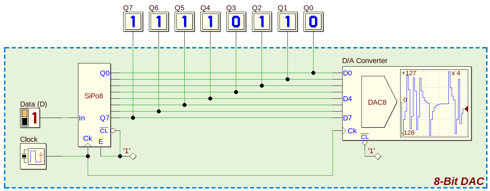

# Forecasting Circuit Output using Recurrent Neural Networks
<p align="center">

</p>

## Overview
I wrote classes in Python 3.7 that represent digital and analog circuit elements, and combined those classes together to create a system that generates time series data.  I compared the performance of two types of Recurrent Neural Networks trained on the time series data.  A **requirements.txt** file is included.  The Python files of interest are:

 - **Circuitry** contains Python classes representing digital and analog circuits used to generate time series data.
 - **train_RNN** generates time series data and uses Keras to train an LSTM and a GRU on the resulting data.
 
The following sections describe how I generated the time series data, and compares the results of the two types of RNNs.

## Recurrent Neural Networks
Christopher Olah has written [an excellent explanation](https://colah.github.io/posts/2015-08-Understanding-LSTMs/) of the workings of LSTMs that has been reproduced in blog posts all over the Internet (sometimes without attribution).  The gist of his explanation is that a Recurrent Neural Network (RNN) is a neural network encased in a loop, which allows information that occurred in the past to persist.  The RNN then "remembers" this past information and can make associations between the present and the past in a fashion that is similar to a human's ability to learn from past experiences.  Regular artificial neural networks have no memory of previous inputs or information, and so they cannot make the kind of associations that are important in performing many types of tasks.  The field of natural language processing in particular has used RNNs to perform tasks such as speech recognition and translating text into other languages.

In practice, the original RNNs struggled with problems that required remembering information that ocurred in the distant past - so called "long-term dependencies."  Long Short-Term Memory (LSTM) networks solved this problem by using four different neural network layers connected together by three "gates" that control what information persists and what information is "forgotten."  Several variants of LSTMs were explored [in a paper](https://arxiv.org/pdf/1503.04069.pdf) that found that none of the variants were significantly better than the "vanilla" LSTM.  However, the Gated Recurrent Unit (GRU) was found to have performance roughly on par with the LSTM on the studied tasks.  The GRU merges two of the LSTM gates and has only 3 neural network layers.  This simpler structure in theory should require less time and fewer computational resources to train.  The goal of this project is to compare the accuracy, number of parameters, and training time of the GRU and LSTM.  


## Source of Time Series Data
RNNs have been used extensively in the field of natural language processing, and there are many tutorials and examples online demonstrating the use of RNNs for financial forecasting.  These examples usually just involve training the RNN on the historical closing prices of a particular stock or financial index and then forecasting its future price.  Obviously, without training the RNN on many more sources of data than just previous prices this is no more reliable than astrology; a kind of "deep divination" if you like.
  
I'm interested in applying RNNs to the field of digital signal processing.  The time series data could be digitized electrical signals captured at RF or baseband frequencies.  The data could also be sensor data representing the inputs and outputs of some system.  However, to make use of the the RNN's ability to learn time dependencies the forecast should rely on not just the current input, but also on previous inputs.  Even better, the current output being forecast should also rely on previous output(s).  Without this time-dependence property, a regular artificial neural network (or other machine learning algorithm) could be used to solve the problem instead.  Finding training data that satisfies these requirements is difficult, and so I decided to generate my own time series data to train the RNNs on.  

## Digital Logic
I was inspired by Andrew Ng's very popular machine learning course on Coursera to investigate digital circuits as a source of time series data.  Professor Ng explained that feedforward neural networks with hidden layers are [universal function approximators](http://neuralnetworksanddeeplearning.com/chap4.html).  This means that a neural network can approximate any arbitrary function within a desired amount of error provided that the network has enough hidden neurons.  Professor Ng demonstrated that the truth table of an OR, AND, or NOR gate could be recreated using a single hidden neuron.  He then demonstrated that more complicated digital circuits could be approximated by a neural network by cascading together these basic building blocks.  My goal is to create a [sequential circuit](https://en.wikipedia.org/wiki/Sequential_logic) that has an output that depends on multiple previous inputs.     

### NAND Gate
<p align="center">

</p>

The NAND gate is itself classified as a "universal gate."  The NAND gate can be combined with itself to represent any other logic gate.  And more than that, the NAND gate has the property of [functional completeness](https://en.wikipedia.org/wiki/NAND_logic) which means that *any Boolean function* can be recreated solely using NAND gates.  In a sense, the NAND gate is to digital logic what a hidden neuron is to function approximation.  I thought that it would be a fun exercise to implement the NAND gate as a Python class, and use it as a building block to create more complicated digital logic circuits. 

I used [Deeds](https://www.digitalelectronicsdeeds.com/deeds.html) (Digital Electronics Education and Design Suite) to draw the NAND gate along with its truth table shown in the image above.  The NAND gate outputs HIGH unless all of its inputs are HIGH; it is the opposite of an AND gate (NOT AND). 

### D-Latch
<p align="center">

</p>

The D-Latch can store a bit/state (HIGH or LOW) in memory, which is necessary to create a sequential circuit.  The NAND gate implementation of a D-Latch is shown in the top-left section of the image above, and the D-Latch equivalent circuit symbol is shown in the bottom-left.  The D-Latch shown here is constructed using 3-input NAND gates to implement the PRESET and CLEAR functionality.  The Python `NAND()` class uses 2-input NAND gates and assumes PRESET and CLEAR are always HIGH.  The values of Q and Q<sub>Bar</sub> are `NAND()` instance variables and can be directly changed to replicate the functionality of the PRESET and CLEAR pins.

Otherwise, the Python `DLatch()` class uses class composition to construct the D-Latch using five NAND gates exactly as shown in the schematic. The D-Latch truth table is simple; when the enable input is HIGH the output Q matches the data input (D).  When enable is LOW, the output remains at its previous state. 

### D Flip-Flop
<p align="center">

</p>

The difference between a D-Latch and a D Flip-Flop is that the latch is level sensitive, while the flip-flop is edge triggered.  An edge-triggered flip-flop is required to implement a shift register and store multiple bits in memory.  If D-Latches are used instead, the input bit propagates through the entire shift register every clock cycle, causing an output of either '1111 1111' or '0000 0000'.  A D flip-flop can be implemented with two D-Latches and a NAND gate inverter as shown in the image above.  The flip-flop circuit symbol looks the same as the D-Latch except for the clock pin (Ck) instead of the enable pin (En).  The flip-flop truth table is the same as the D-Latch except that it is triggered by the clock's rising/falling edge as shown by the up/down arrows.  The flip-flop shown is positive edge triggered (PET).  For this exercise I am assuming that the time series data is sampled synchronously with the clock, and so the flip-flop class simulates a full clock cycle (rising and falling transition) whenever it is clocked.

### Shift Register
<p align="center">

</p>

The D flip-flops can be cascaded together to store multiple bits in memory.  The schematic above shows an 8-bit SIPO (Serial In Parallel Out) shift register implemented with flip-flops, and its equivalent circuit symbol below.  Input bits propagate sequentially through each flip-flop every clock cycle (LOW/HIGH transition).  Each bit in memory is accessible simultaneously in a parallel fashion. 

### Digital-to-Analog Converter (DAC)
<p align="center">

</p>

Now that the shift register is implemented, something interesting needs to be done with the bits in memory.  A digital-to-analog converter (DAC) transforms binary data into an analog output voltage.  I wrote a Python class that accepts a list of bits and converts them to an analog voltage using [offset binary](https://en.wikipedia.org/wiki/Offset_binary).  For an 8-bit DAC the result looks similar to the schematic above.  The 8-bit binary input will be converted into a number between -128 (0000 0000) and +127 (1111 1111), and that number will be divided by 128 and multiplied by a reference voltage.  The output will thus be 256 discrete values ranging from VRef * (-128/128) Volts to VRef * (127/128) Volts.

## Analog Circuits
This is a good start for generating time series data, but the circuit doesn't require an RNN to make predictions.  A regular neural network could be trained on all 256 possible 8-bit inputs, and the time series data could simply be fed into the trained neural network using an 8-bit sliding window.  Predicting the output of the circuit is then just a regression problem as the same inputs will always result in the same output.  I added some analog circuit elements to make the generated data more suitable for RNNs.

### RC Circuit
<p align="center">

</p>

Currently, the output of the circuit relies only on the eight most recent inputs.  I added an RC circuit to the output of the DAC so that the current output also relies on the *previous* output.  An RC circuit is composed of a series resistor and capacitor, as shown in the [LTspice](https://www.analog.com/en/design-center/design-tools-and-calculators/ltspice-simulator.html) schematic above.  When a voltage is applied to an RC circuit, the capacitor draws current and develops a voltage across its terminals that increases over time.  Similarly, when the applied voltage is removed (or decreased) the capacitor discharges current and the voltage across its terminals decreases over time.  The time required to fully charge or discharge the capacitor depends on its time constant tau, which is the product of R times C in units of seconds.  A duration of five time constants (5 * tau) is approximately the time required to fully charge or discharge the capacitor.

The LTspice plot above shows the RC circuit charging and discharging when a square wave voltage is applied to the circuit.  The voltage across the capacitor at some time t is calculated according to the equation:

V<sub>Cap</sub> = V<sub>Applied</sub> - (V<sub>Applied</sub> - V<sub>Initial</sub>) \* exp(t / tau)

Where V<sub>Applied</sub> is the voltage applied to the RC circuit, and V<sub>Initial</sub> is the initial voltage across the capacitor before the new voltage was applied.  The RC circuit shown in the schematic has a time constant of 1 second (1 Ohm * 1 Farad), whereas the applied square wave voltage has a period of 10 seconds.  This means that the square wave (green trace) is at high voltage for 5 tau, and then at low voltage for another 5 tau.  The voltage across the capacitor (red trace) appears to fully charge and discharge each cycle, as expected.

This has two interesting effects on the circuit: first, the output of the circuit depends on its previous output as well as its previous inputs.  As the capacitor charges and discharges, the same input bits will produce different output voltages.  Second, the time constant of the RC circuit determines how sensitive the output is to changes in the input.  The RC circuit acts like a low-pass filter where changes in the applied voltage that happen quickly relative to tau (high frequency) are attenuated.   
 
### Random noise
The final step is to add random noise to the output of the DAC.  All analog circuits are subject to various sources of noise, some of which are commonly modeled as Additive White Gaussian Noise (AWGN).  AWGN noise is applied to the RC circuit in addition to the output of the DAC.  This makes the problem more interesting as the circuit output is no longer purely deterministic.  Because AWGN is zero mean, it will tend to be filtered out by the RC circuit to a more or lesser degree depending on the time constant tau.


## Training the RNNs
My reference for training an RNN using Keras is [an example](https://apmonitor.com/do/index.php/Main/LSTMNetwork) on the APMonitor website.  An LSTM was used to predict the temperature of an electronic heater given the heater control signal as an input.  The current output temperature of course also depends on the previous output temperature, and so it's a similar system to the circuit that I have developed.  Following their example, I created an LSTM with three layers of 50 neurons each.  After each LSTM layer is a dropout layer to prevent over-fitting as shown in the table below.  The architecture of the GRU model is identical save for GRU layers instead of LSTM layers.  Both models accept an input of shape (batch_size, 8, 2) where the 8 represents a sliding window of 8 data points to match the circuit's 8-bit shift register and DAC.  The models accept two (2) windows of 8 data points that represent the previous 8 inputs and the previous 8 outputs.  This training data is generated using FOR loops to create the sliding window of 8 data points for both the input bits and output voltages.  The training data is the first 85% of the 65,636 data points generated by the circuit, and the test data is the last 15% of the data (last 9,831 data points).  The data must not be shuffled or have its chronological order altered when splitting it into training and test sets.

```text
_________________________________________________________________
Layer (type)                 Output Shape              Param #   
=================================================================
lstm_25 (LSTM)               (None, 8, 50)             10600     
_________________________________________________________________
dropout_25 (Dropout)         (None, 8, 50)             0         
_________________________________________________________________
lstm_26 (LSTM)               (None, 8, 50)             20200     
_________________________________________________________________
dropout_26 (Dropout)         (None, 8, 50)             0         
_________________________________________________________________
lstm_27 (LSTM)               (None, 50)                20200     
_________________________________________________________________
dropout_27 (Dropout)         (None, 50)                0         
_________________________________________________________________
dense_9 (Dense)              (None, 1)                 51        
=================================================================
Total params: 51,051
Trainable params: 51,051
Non-trainable params: 0
_________________________________________________________________
```

<p align="center">

</p>

I trained both models for 20 epochs and found that their training loss matched very closely, as shown by the figure above.  The GRU architecture has 3/4 as many trainable parameters as the LSTM, which is expected as the GRU has three neural networks to the LSTM's four.  The average training time did not differ significantly between the two architectures as demonstrated by the table below.  The number of layers/parameters and amount of training data is probably not large enough for there to be a significant difference in training time between the two architectures. 

| RNN   | Parameters | Average Training Time |
| :---: | :---:      | :---:                 |
| LSTM  | 51,051     | 115.23 s              |
| GRU   | 38,301     | 113.81 s              |


## Performance Comparison: LSTM vs. GRU
I performed the comparison between the LSTM and GRU models for three different RC circuit time constants.  The input bits (1s and 0s) were generated with a random number generator that was provided the same seed for all three variations.  The AWGN added to the output of the DAC was also provided this same seed.  The result is that the input bits and AWGN are identical for all three trials.  The only difference is the time constant tau of the RC circuit.

| Tau = 0.2 | Tau = 5 |
| :---:     | :---:   |
|  |  |

The first 100 clock cycles of the generated data is shown in the plots above for tau = 0.2 clock cycles and tau = 5 clock cycles.  The DAC output (red line) and noisy output (green dotted line) are the same for both plots.  The only difference is the RC output voltage (black dashed lines).  In the tau = 0.2 clock cycle case, the output of the RC circuit follows the noisy output almost exactly.  This is because one clock cycle is equal to 5 time constants, which is enough to charge or discharge the capacitor to nearly 100% of the applied voltage.  The RC circuit is not filtering out any of the noise and is in fact passing the noisy signal almost unchanged.  The tau = 5 clock cycles case shows a smoother, lower amplitude response from the RC circuit.  This is because a clock cycle is only 0.2 time constants for this case, which only charges the capacitor to about 18% of its applied voltage.  The AWGN is strongly suppressed as it is zero mean and the RC circuit acts like a low-pass filter due to its long time constant.  The case of tau = 1 clock cycle falls between these two extremes as one time constant results in the capacitor charging to about 63% of its applied voltage.  Some of the noise is filtered out, but not as much as the tau = 5 clock cycles case.    

Evaluating the performance of an RNN is done somewhat differently than for a traditional neural network.  As mentioned in the previous section, the LSTM and GRU models are fed input data that contains both the previous 8 inputs and the previous 8 outputs of the circuit.  This same sliding window format is applied to the test data.  The trick here is that the RNN model will only predict the next single output point given the previous 8 inputs and outputs of the circuit.  However, the previous 8 outputs fed into the model are always the correct (ground truth) values regardless of what the model actually predicted for those previous outputs.  This means that using the Keras `predict()` method on the test data gives results that are unrealistically accurate, because every prediction the model makes is independent of its previous predictions.  Instead, the proper way to evaluate the model is to *forecast* future results.  In order to do this, a FOR loop is used to feed the model its own previous predictions for the previous 8 outputs of the circuit.  The model is given the ground truth outputs for the first 8 points of the test data, but from that point forward it only has the input bits and its own previous predictions to forecast the next 9,823 outputs in the test data.  Errors in the model's predictions will compound and the forecast will drift away from the ground truth over time.  The model's performance is evaluated by finding the mean squared error of the forecasted test data.

| Tau   | LSTM MSE | GRU MSE |
| :---: | :---:    | :---:   |
| 0.2   | 0.03971  | 0.04008 |
| 1     | 0.01899  | 0.01894 |
| 5     | 0.00538  | 0.00560 |

As can be seen in the table above, the performance of the LSTM and GRU are almost identical.  Both architectures do a good job of forecasting the test data shown in the plots below for tau = 0.2 and tau = 5.  The last 100 points of the forecast are plotted, which is where the most drift would be expected to occur.  Even so, both the LSTM (red line) and the GRU (green line) match the ground truth (black dashed line) closely.  Not surprisingly, the tau = 5 case has the lowest MSE while the tau = 0.2 has the highest MSE, and tau = 1 falls in between.  This is because the tau = 5 case filters out most of the AWGN noise, which makes the system more deterministic and thus easier to accurately forecast.  The tau = 0.2 case has the most random noise and thus the most uncertainty or error in the forecast.

| Tau = 0.2 | Tau = 5 |
| :---:     | :---:   |
|  |  |


## Acknowledgments
Thanks to Giuliano Donzellini for creating and distributing the [Deeds](https://www.digitalelectronicsdeeds.com/) digital circuit simulator.  I used Deeds to create the schematics in this document and validate the behavior of my Python implementations of digital circuits.

Thanks also to the APMonitor website for sharing their Python code for the [temperature control lab](https://apmonitor.com/do/index.php/Main/LSTMNetwork) exercise.
